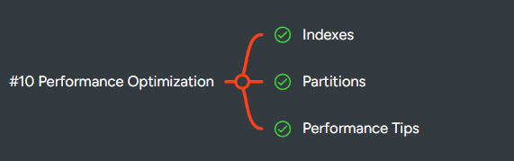

 

---

# 🟢 EASY (Basic Performance & Index Concepts) — 8 Questions

1. List all orders placed by a customer — optimize query for faster retrieval.
2. Find products with price > 500 — check which indexes could improve performance.
3. Show employees in the Sales department — try creating an index on `department`.
4. Count the number of orders for each customer — think about how indexing helps aggregation.
5. Retrieve all orders in the last 30 days — suggest an index on `order_date`.
6. Select customers from a specific city — experiment with an index on `city`.
7. Show products whose name contains 'Pro' — discuss when an index helps.
8. Display orders sorted by `order_amount` — consider using an index to speed up ORDER BY.

---

# 🟡 MEDIUM (Indexing, Joins & Optimization) — 10 Questions

9. Optimize a query that **joins orders and customers** to find total orders per customer.
10. Optimize a query joining **orders and order_archive** — what indexes help?
11. Show top 5 products by revenue per category — consider indexing `category_id` and `product_id`.
12. Count orders per month — how does indexing `order_date` help?
13. Optimize query filtering **employees with salary > X** — create an index.
14. Optimize a query joining **employees and orders** on employee_id.
15. Find customers who placed more than 5 orders — discuss composite indexes.
16. Show archived orders by month — discuss partitioning by `order_date`.
17. Retrieve products sorted by stock — create an index on `stock`.
18. Optimize search queries with LIKE '%something%' — discuss index limitations.

---

# 🔴 HARD (Advanced Optimization, Partitioning & Indexing) — 12 Questions

19. Partition `orders` table by month — write queries to utilize partitions.
20. Partition `order_archive` by year — show query performance improvement.
21. Create a **composite index** on `customer_id` + `order_date` — analyze query benefit.
22. Optimize **heavy join queries** with indexes and partitions.
23. Optimize **aggregation queries** on millions of rows.
24. Compare **clustered vs non-clustered index** usage.
25. Create a **covering index** to improve a specific query.
26. Optimize query using **window functions** on large tables.
27. Partition `products` table by category — write query to fetch top 3 per category.
28. Optimize **subquery queries** using indexes.
29. Optimize **CTE or recursive queries** on large datasets.
30. Analyze slow queries using **EXPLAIN PLAN** and suggest improvements.

---

## ✅ KEY CONCEPTS

**Indexes**

* Speeds up retrieval for SELECT, JOIN, WHERE, ORDER BY.
* Types: **B-Tree, Hash, Unique, Composite, Covering, Full-text**.
* Trade-off: More indexes → slower INSERT/UPDATE/DELETE.

**Partitioning**

* Split large tables into smaller parts (by RANGE, LIST, HASH).
* Queries scan **only relevant partitions** → faster performance.
* Types: **Range, List, Hash, Composite**.

**Query Optimization Tips**

* Avoid `SELECT *` → fetch only needed columns.
* Use **joins instead of subqueries** where possible.
* Use **EXISTS / IN** wisely.
* Avoid functions in WHERE clause that prevent index usage.
* Check **execution plan** for bottlenecks.
* Use **batch updates** instead of row-by-row operations.

---
