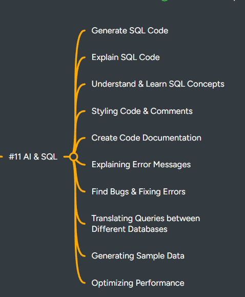

Here’s a **clean, professional README-style version** of your AI + SQL guide, keeping all your content intact but formatted for readability and clarity:

---



# AI & SQL: How AI Helps You Become a Better SQL Developer

**Perfect! You’re now talking about how AI can be used in SQL workflows. This guide shows industry-level applications, with practical examples for development, learning, debugging, and optimization.**

---

## 1️⃣ Generate SQL Code

* AI can **write queries for you** from plain English prompts.
* **Example:**
  *“List top 5 customers by total order amount in 2025”* → AI generates the SQL query automatically.
* **Use Case:** Speeds up development for repetitive or complex queries.

---

## 2️⃣ Explain SQL Code

* AI can break down queries **line by line**, explaining:

  * What each clause does (`SELECT`, `JOIN`, `WHERE`, `GROUP BY`, etc.)
  * How rows are filtered and aggregated
* **Benefit:** Helps beginners understand **why a query works**.

---

## 3️⃣ Understand & Learn SQL Concepts

* AI can teach:

  * Joins (INNER, LEFT, RIGHT, FULL)
  * Window functions (`ROW_NUMBER()`, `LAG()`, `LEAD()`)
  * Aggregations, CTEs, subqueries, etc.
* **Use Case:** Quick learning for interviews or new SQL features.

---

## 4️⃣ Styling Code & Comments

* AI can automatically format messy SQL:

  * Proper indentation
  * Capitalized keywords
  * Meaningful aliases
* Add **comments** to explain logic.

**Example:**

```sql
-- Get top 5 customers by revenue
SELECT customer_id, SUM(order_amount) AS total_revenue
FROM orders
GROUP BY customer_id
ORDER BY total_revenue DESC
LIMIT 5;
```

---

## 5️⃣ Create Code Documentation

* AI can generate **documentation** for stored procedures, triggers, and ETL scripts.
* Example: Describe **what tables, joins, and aggregations are used**, for easier team handoff.

---

## 6️⃣ Explaining Error Messages

* SQL errors can be cryptic (`ORA-00936: missing expression`, `Syntax error near 'FROM'`).
* AI can **explain the error** in plain English and suggest a fix.
* **Benefit:** Faster debugging, less frustration.

---

## 7️⃣ Find Bugs & Fix Errors

* AI can **analyze broken SQL** and:

  * Suggest syntax fixes
  * Optimize logic
  * Correct column/table references
* **Use Case:** Correct queries before running them on production tables.

---

## 8️⃣ Translating Queries Between Different Databases

* SQL dialects differ: MySQL, PostgreSQL, SQL Server, Oracle.
* AI can **translate queries automatically**:

  * Example: `LIMIT` → `TOP`
  * `STRING_AGG()` vs `GROUP_CONCAT()`

---

## 9️⃣ Generating Sample Data

* AI can **generate realistic sample datasets** for practice/testing.
* Example:

  * `customers` with fake names, cities, emails
  * `orders` with random dates, amounts, and customer IDs
* Useful for **learning joins, window functions, and testing queries** without real data.

---

## 🔟 Optimizing Performance

* AI can **suggest query improvements**, like:

  * Adding indexes
  * Rewriting subqueries as joins
  * Using window functions efficiently
  * Avoiding `SELECT *`
* Can explain **execution plans** in simple terms.

---

## ✅ Extra Tips for Using AI in SQL

1. Always **validate AI-generated queries** before running them on production.
2. Use AI for **learning, documentation, and optimization**, not as a replacement for understanding SQL.
3. Combine AI help with **real practice on actual datasets**.
4. Keep track of **common mistakes AI catches** — it’s like an instant mentor.
5. Use AI to **convert messy queries into readable, maintainable SQL**.

---

If you want, I can **create a full industry-level AI + SQL practice plan** showing:

* **Exact prompts to use AI for SQL generation**
* **Examples of AI fixing queries**
* **Optimizing SQL with AI step by step**
