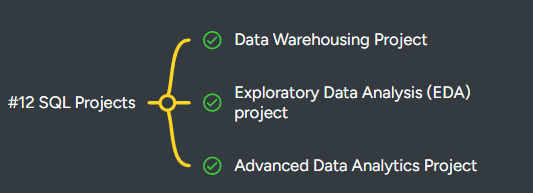

---

---

## 1️⃣ Beginner SQL Projects

**Goal:** Practice basic queries, filtering, joins, and aggregates.

1. **Customer Order Report**

   * **Tables:** `customers`, `orders`
   * **Tasks:** Total orders per customer, average order amount, highest order, number of orders per city.

2. **Product Inventory Report**

   * **Tables:** `products`
   * **Tasks:** Products in stock < 10, total value of inventory, categorize products by price range.

3. **Employee Salary Report**

   * **Tables:** `employees`
   * **Tasks:** Average salary per department, highest/lowest salary, employees earning above/below average.

4. **Orders Summary Dashboard**

   * **Tables:** `orders`
   * **Tasks:** Orders per month, total revenue per month, top 5 customers by revenue.

5. **Archived Orders Analysis**

   * **Tables:** `order_archive`
   * **Tasks:** Compare archived orders with current orders, find customers who didn’t order recently.

---

## 2️⃣ Intermediate SQL Projects

**Goal:** Practice advanced joins, subqueries, CTEs, window functions, and aggregates.

6. **Top Selling Products**

   * **Tables:** `orders`, `products`
   * **Tasks:** Top 5 products by quantity sold, total revenue per product, cumulative revenue.

7. **Customer Segmentation**

   * **Tables:** `customers`, `orders`
   * **Tasks:** Segment customers based on total spending (high/medium/low), find loyalty trends, orders per segment.

8. **Employee Performance Analysis**

   * **Tables:** `employees`, `orders`
   * **Tasks:** Total orders handled, total revenue per employee, ranking employees by performance using window functions.

9. **Monthly Revenue Trends**

   * **Tables:** `orders`, `order_archive`
   * **Tasks:** Revenue per month, growth rate, moving averages, compare current vs archived orders.

10. **Category Analysis for Products**

    * **Tables:** `products`, `orders`
    * **Tasks:** Revenue per category, average product price per category, most profitable category.

---

## 3️⃣ Advanced SQL Projects

**Goal:** Practice performance optimization, stored procedures, triggers, partitioning, and complex analytics.

11. **Top N Customers per Region**

    * **Tables:** `customers`, `orders`
    * **Tasks:** Top 3 customers per city/region by total revenue, use window functions and ranking.

12. **Sales Forecasting Prep**

    * **Tables:** `orders`, `order_archive`
    * **Tasks:** Aggregate monthly sales, calculate trends, prepare data for forecasting.

13. **Inventory Alert System**

    * **Tables:** `products`, `orders`
    * **Tasks:** Trigger to alert when stock < 10, procedure to update inventory, create reporting table using CTAS.

14. **Employee Bonus Calculation**

    * **Tables:** `employees`, `orders`
    * **Tasks:** Procedure to calculate 10% bonus for employees meeting sales targets, rank employees by bonus.

15. **Comprehensive Sales Dashboard**

    * **Tables:** All tables
    * **Tasks:**

      * Total revenue per month, per category, per employee
      * Identify top customers, slow-moving products
      * Use CTEs, window functions, joins, and aggregations
      * Store results in a summary table (CTAS)

16. **Data Cleanup & Archival Automation**

    * **Tables:** `orders`, `order_archive`
    * **Tasks:**

      * Trigger to auto-archive old orders
      * Procedure to delete outdated data
      * Partition archived orders by year

17. **Customer Retention Analysis**

    * **Tables:** `customers`, `orders`, `order_archive`
    * **Tasks:** Identify inactive customers, calculate churn rate, segment customers by recency, frequency, and monetary value (RFM analysis).

18. **Revenue Contribution per Product**

    * **Tables:** `products`, `orders`
    * **Tasks:** Rank products by contribution to total revenue, calculate percentage of total revenue per product, identify top 20% revenue-generating products.

19. **Monthly Comparison Report**

    * **Tables:** `orders`, `order_archive`
    * **Tasks:** Compare current month vs previous month revenue, growth/decline percentages, highlight top-performing employees and products.

20. **Cross-Database Query Translation**

    * **Tables:** Any tables
    * **Tasks:** Write queries in **MySQL, then translate to PostgreSQL/SQL Server**, including syntax adjustments for joins, limits, date functions.

---

## ✅ Tips for SQL Projects

* Always **start with a schema diagram** for your tables.
* Use **CTEs, window functions, and subqueries** for intermediate/advanced projects.
* Test queries on **small datasets first** before running on full tables.
* Document your SQL: comments, stored procedures, or markdown reports.
* Focus on **end-to-end data flow**: raw tables → transformation → final analytics/report.
* Incorporate **performance considerations**: indexes, partitioning, avoiding unnecessary joins.

---
