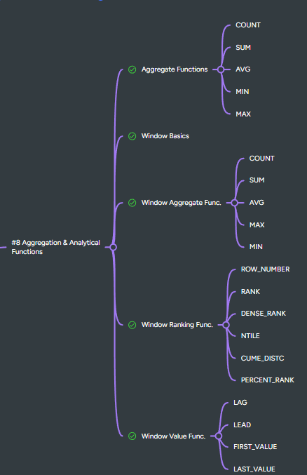

# SQL Window Functions Practice: Beginner → Advanced

**Master analytic calculations like ranking, running totals, and moving averages using window functions.**

---

## 🟢 BASIC WINDOW FUNCTIONS — 8 Questions

1. Assign a **row number** to each order based on `order_date`.
2. Assign a **rank** to employees based on salary (highest salary = rank 1).
3. Assign a **dense rank** to products based on their price.
4. Show **cumulative total order amount per customer**.
5. Find the **previous order amount** for each customer.
6. Find the **next order date** for each customer.
7. Calculate **running total of orders per month**.
8. Assign a row number to products **within each category**.

---

## 🟡 WINDOW AGGREGATE FUNCTIONS — 8 Questions

9. Calculate the **average order amount per customer** using a window function.
10. Calculate **total sales per employee** and display alongside each order.
11. Find **maximum product price per category** and display for each product.
12. Calculate **minimum order amount per customer**.
13. Show **cumulative sum of product quantities** ordered.
14. Find **moving average of order amounts** for each customer (last 3 orders).
15. Calculate **rank of employees** based on total handled order amounts.
16. Show **percentage contribution of each order** to a customer’s total orders.

---

## 🔴 HARD WINDOW FUNCTION QUESTIONS — 8 Questions

17. Calculate **running total of revenue per month** across all customers.
18. Assign **rank based on revenue within each product category**.
19. Calculate **lag of order amount** to find difference with previous order.
20. Calculate **lead of delivery date** to estimate next delivery per customer.
21. Show **cumulative percentage of total sales per product**.
22. Find **top 3 employees per department based on sales handled**.
23. Calculate **difference between current row and average over last 5 orders**.
24. Rank **customers by total spending**, and show percentile within all customers.

---

## ✅ COMMON WINDOW FUNCTIONS

| Function                     | Use Case                               |
| ---------------------------- | -------------------------------------- |
| `ROW_NUMBER()`               | Sequential number per window           |
| `RANK()`                     | Rank with gaps for ties                |
| `DENSE_RANK()`               | Rank without gaps                      |
| `NTILE(n)`                   | Divide rows into n buckets             |
| `SUM() OVER()`               | Running total                          |
| `AVG() OVER()`               | Running average                        |
| `MAX() OVER()`               | Maximum over window                    |
| `MIN() OVER()`               | Minimum over window                    |
| `LAG()/LEAD()`               | Previous/next row value                |
| `FIRST_VALUE()/LAST_VALUE()` | First/last in window                   |
| `PERCENT_RANK()/CUME_DIST()` | Percentile and cumulative distribution |

---

## ✅ PRACTICE TIPS

* Always define **PARTITION BY** to limit the window to a group.
* Use **ORDER BY** in window functions for ranking, cumulative totals, or running averages.
* Window functions **do not reduce rows** — they add calculated columns.
* Combine with **WHERE carefully**: filtering on window function results often requires a **subquery**.
* Ideal for **analytics, KPI dashboards, and trend analysis**.

---
